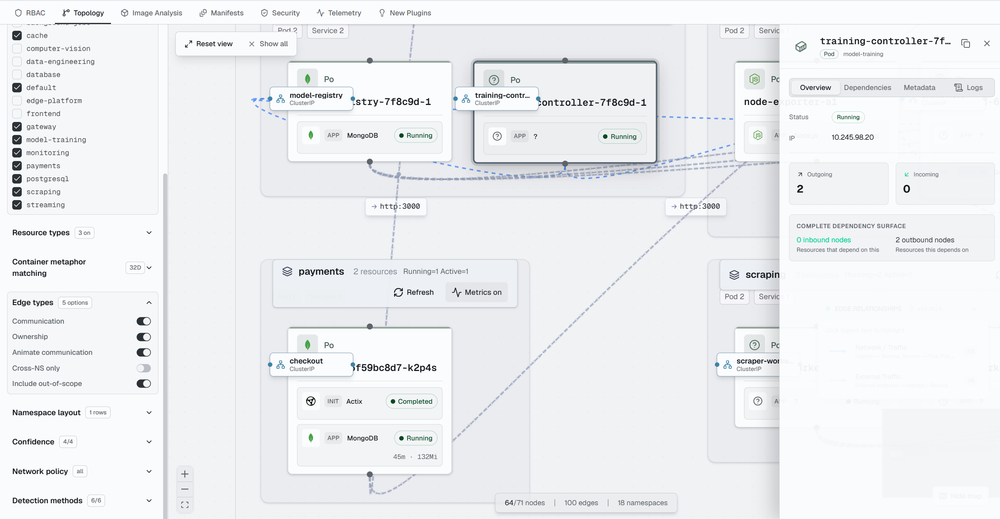
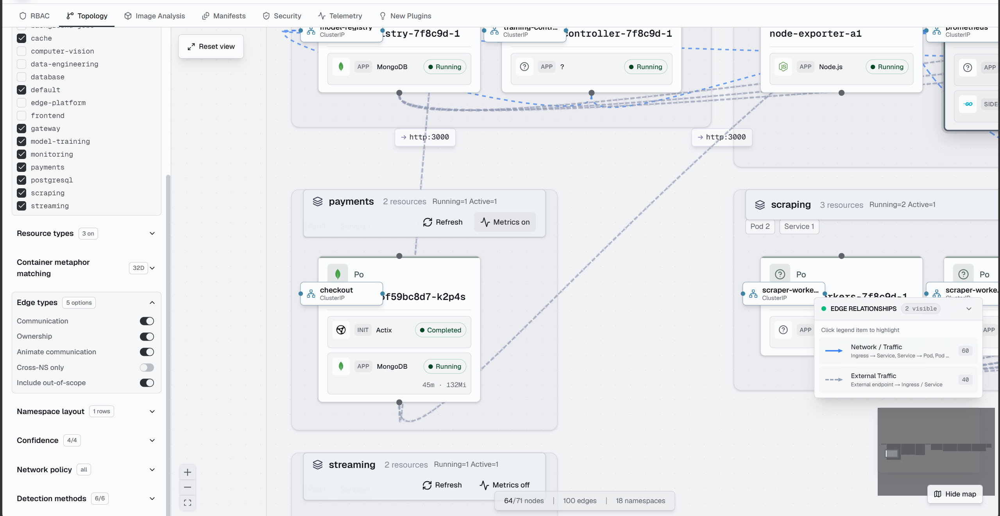
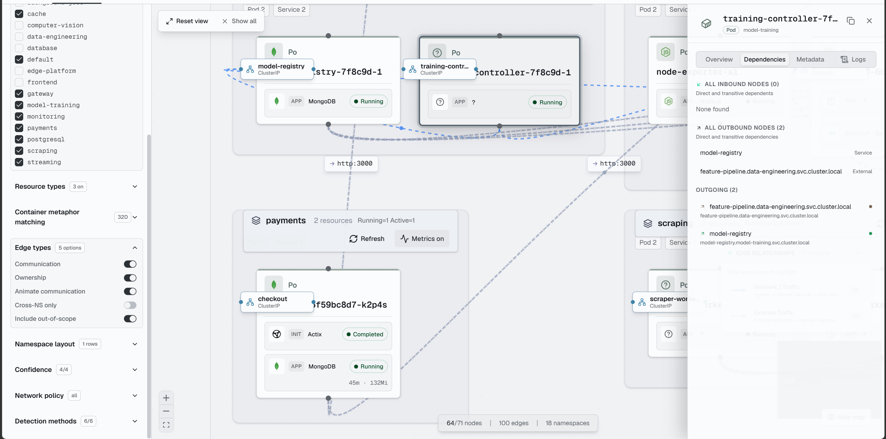
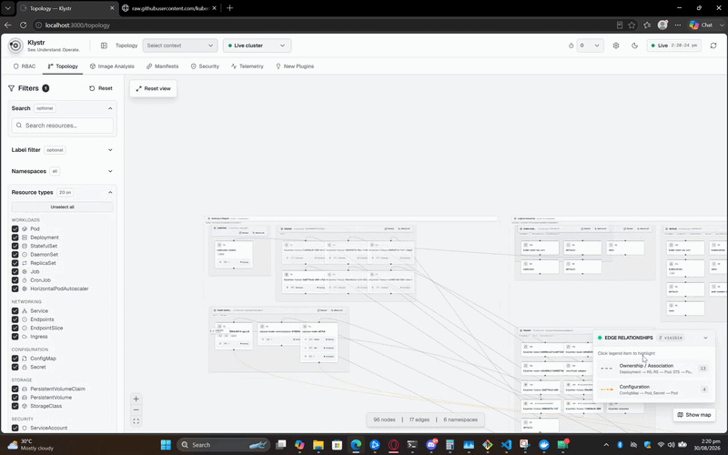
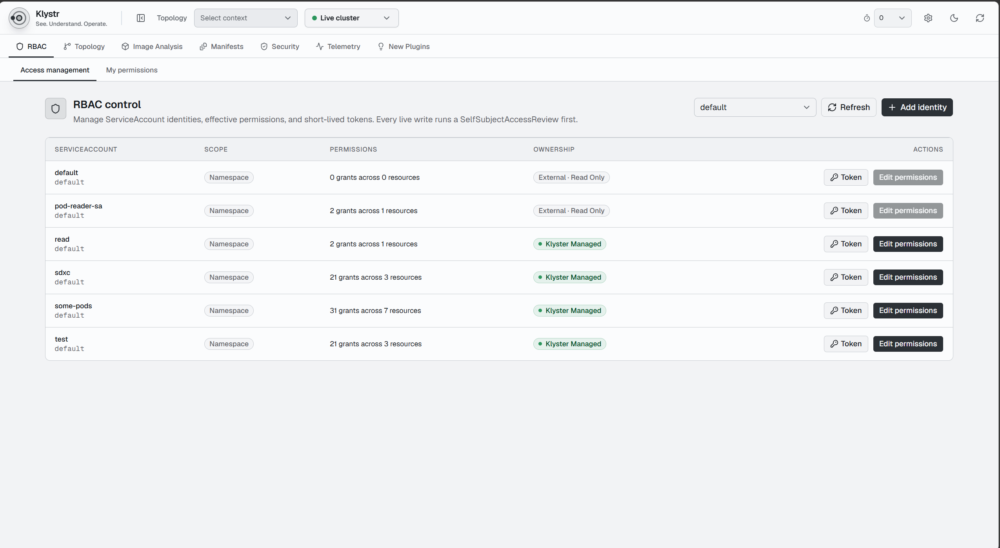
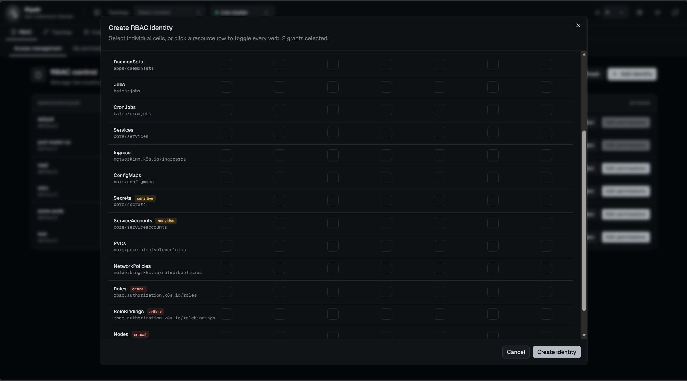
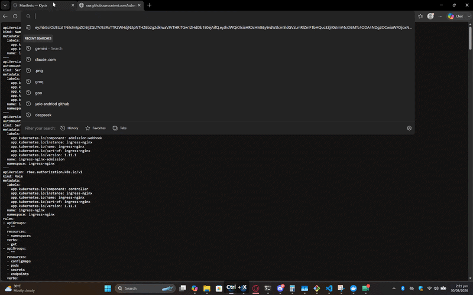
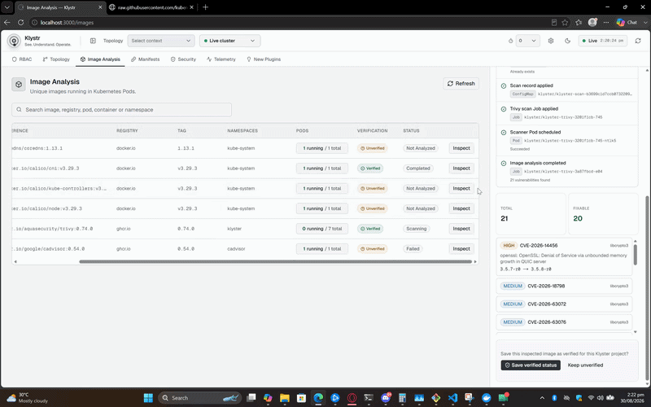
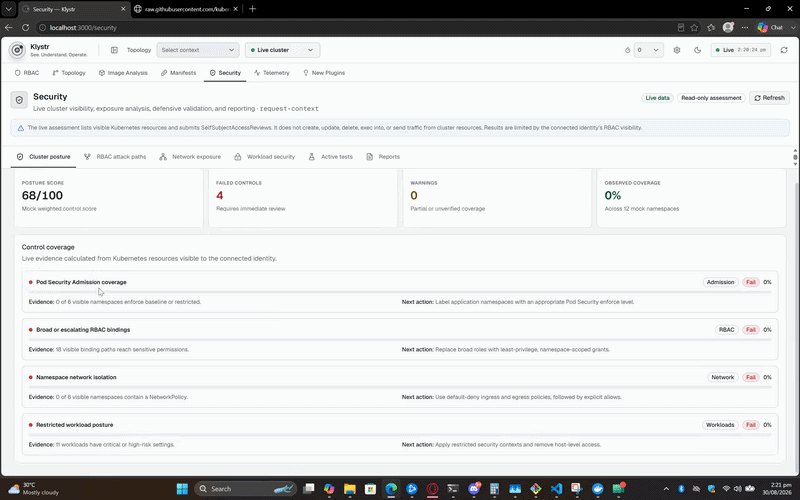
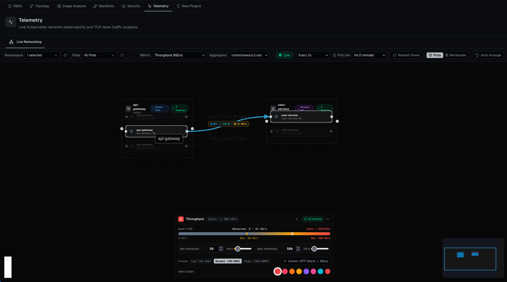

# Klystr

Klystr is a local-first Kubernetes operations workspace for understanding how a growing application fits together. It brings resource topology, dependency discovery, RBAC inspection, manifest analysis, container-image security, and cluster security checks into one visual interface.

It is designed for the point where `kubectl get pods` is no longer enough. A modern product may have more than 100 APIs spread across backend microservices, frontend services, cache and database layers, AI model endpoints, data-engineering pipelines, scheduled jobs, and supporting infrastructure. One feature may call three services, while several other services consume its output. At that scale, answering simple questions becomes difficult:

- Which workloads and configuration objects support this feature?
- What consumes this service, and what will be affected if it changes?
- Which Pod, Service, Ingress, ConfigMap, Secret, or volume participates in the request path?
- Which identity can access a sensitive resource?
- Which container image is deployed, and what vulnerabilities does it contain?
- Is a new release safe to integrate without breaking an existing dependency?

Klystr helps developers and platform teams build that mental model from Kubernetes data instead of maintaining it manually across diagrams, terminal sessions, spreadsheets, and tribal knowledge.

> [!WARNING]
> Klystr is an experimental, developer-focused project. Use it locally or inside a trusted private engineering environment. It has not been designed or audited as an internet-facing control plane.

## What the project is for

Klystr is intended to reduce the operational cost of understanding and changing distributed systems. Its primary use cases are:

- exploring an unfamiliar Kubernetes environment;
- tracing relationships between workloads, services, configuration, storage, and external endpoints;
- reviewing the likely impact of a new feature or deployment;
- discovering security, identity, and image risks before they become incidents;
- giving application developers useful cluster context without requiring them to memorize every Kubernetes command;
- providing one extensible shell where additional operational tools can be added as isolated plugins.

Klystr does not replace Kubernetes, GitOps, CI/CD, an observability platform, a vulnerability-management program, or a production incident-management system. It complements those tools by presenting their Kubernetes-facing relationships in a developer-friendly workspace.

## Example: understanding one feature across 100+ APIs

Consider a recommendation feature in a large platform:

1. A frontend calls an API gateway.
2. The gateway calls identity, catalogue, and recommendation services.
3. The recommendation service reads from a feature cache, invokes a hosted AI model, and writes an event.
4. Fraud, analytics, and notification services consume that event.
5. A data pipeline later aggregates the results and retrains or refreshes model inputs.

A seemingly small schema, configuration, image, permission, or network change can therefore affect many independently deployed components. Klystr is built to help reveal those connections, show the Kubernetes objects behind them, inspect the identities and images involved, and narrow the investigation by namespace or resource type. This makes feature integration and release review more deliberate while leaving the existing application code and deployment workflows untouched.

## Features

### Topology and dependency discovery

The topology workspace progressively discovers namespaces and selected Kubernetes resource kinds, then renders their relationships as an interactive graph. Resources are grouped by Kubernetes Node and namespace; unscheduled logical resources are represented separately so the graph does not imply false Node ownership.

Relationship detectors use Kubernetes-native evidence such as owner references, Service selectors, Ingress backends, environment variables, command arguments, URLs, ConfigMap and Secret references, and volume mounts. Developers can search, filter labels, select namespaces and resource types, inspect incoming and outgoing dependencies, view Pod metadata and logs, and optionally request namespace-level Pod metrics when Metrics Server is available.

For large clusters, progressive discovery and per-kind limits avoid trying to render thousands of objects at once. The goal is an investigable graph, not an unreadable cluster dump.

### RBAC

The RBAC workspace explains Kubernetes ServiceAccounts, Roles, ClusterRoles, and bindings in one place. It helps teams understand which identity can perform an action and provides diagnostic guidance when access is denied.

Live mutations are guarded by Kubernetes `SelfSubjectAccessReview` checks, including the special `bind` and `escalate` permissions. Klystr-managed objects are labelled, while externally managed identities remain visible without being treated as project-owned. Token creation uses the Kubernetes TokenRequest API and issued tokens are not persisted by the UI.

### Manifest graph

The manifest workspace analyzes uploaded Kubernetes YAML without requiring it to be applied to a cluster. It builds a virtual object inventory and relation graph, highlights conflicts and configuration findings, and lets developers inspect how a proposed change fits together before deployment.

This is useful during feature development: a team can review Deployments, Services, configuration, storage, and identity objects as a connected unit while keeping the analysis separate from the live cluster.

### Image analysis

Image Analysis inventories the images already discovered from live Pods. For an approved image, Klystr can create a constrained Trivy Kubernetes Job, observe its progress, read the completed JSON report from Pod logs, normalize findings, and show vulnerabilities in the workspace.

The browser cannot supply arbitrary scanner commands or flags. Scans are limited to server-discovered images, resource quantities are validated, concurrency and report sizes are bounded, and the scanner ServiceAccount is designed without Kubernetes API permissions. Scan state can be recovered from project-owned ConfigMaps. Verified image identities are signed so tampering or verification-secret rotation is visible.

Image Analysis is a supporting review tool, not a substitute for scanning images in CI, signing and admission policies, registry controls, or a maintained vulnerability-management process.

### Security

The security workspace assembles a read-oriented snapshot of workload posture, RBAC exposure, network exposure, and likely attack paths. It is intended to help developers spot risky defaults—such as excessive privileges, sensitive API access, token exposure, or weak workload security settings—and understand where deeper review is required.

Security results are evidence for investigation, not a compliance certification or a guarantee that a cluster is secure.

### Telemetry (Live Networking)

The Telemetry workspace provides real-time Kubernetes network observability and TCP-level traffic analysis by streaming eBPF flow data directly from Cilium Hubble Relay (with automatic fallback to high-fidelity live simulation when running offline).

Key capabilities include:

- **Live Flow Streaming**: Discovers and visualizes real-time pod-to-pod and service-to-service communication paths using Server-Sent Events (SSE) backed by a native Hubble gRPC client.
- **5 Core TCP/IP Metrics**: Inspect real-time network dynamics across Throughput (KB/s), Packet Rate (pps), Active TCP Connections, TCP Retransmission Rate (%), and Round Trip Time (RTT ms).
- **Interactive Heatmap Bar & Threshold Coloring**:
  - Live color-coded edges dynamically transition based on user-configured Min/Max thresholds, sliders, and presets (`Low`, `Normal`, `High`).
  - Standard mode (alert on traffic spikes exceeding threshold) and Inverted mode (alert when traffic drops below expected baseline).
  - Customizable alert palette with real-time feedback on exceeding edges.
- **Topology & Aggregation Controls**:
  - Toggle between granular Pod replica view and aggregated Workload view.
  - Namespace and pod multi-select filtering with automatic layout arrangement.
  - Animated particle/dash streams showing live traffic volume and direction.
- **Trend Sparklines**: Click any metric edge label to inspect an SVG sparkline showing real-time rolling metric history across live ticks.
- **Telemetry Doctor**: Built-in connectivity health checker and diagnostic suite to test Hubble Relay endpoints, gRPC ports, NodePort routing, and Kubernetes RBAC readiness.

### Plugin ideas

The New Plugins area is a forward-looking surface for additional operational capabilities. Features can be introduced as separate plugins instead of expanding a single tightly coupled application.

## Demos

The following recordings and screenshots show the current workspaces in action. All demo assets are stored in [`demos/`](demos).

### Topology and dependency discovery

[Watch the topology walkthrough (MKV)](demos/topology/Video.mkv)









### RBAC





### Manifest analysis



### Image analysis



### Security



### Live Networking (Telemetry)



## Architecture

Klystr uses a central Next.js shell with independently deployable feature boundaries.

```text
Browser
  |
  v
Klystr shell (layout, navigation, theme, connection state, plugin registry)
  |
  +-- Topology plugin
  +-- RBAC plugin
  +-- Image Analysis plugin
  +-- Manifest plugin
  +-- Security plugin
  +-- Telemetry plugin (Live Networking & Hubble Relay)
  |
  v
Same-origin server routes
  |
  +-- Process-local connection registry
  +-- Kubernetes client and discovery services
  +-- Relationship detectors and graph builder
  +-- Feature-specific services
  |
  v
Kubernetes API (through a trusted private network or VPN)
```

The shell owns cross-cutting concerns: workspace layout, navigation, theme, Kubernetes connection state, plugin discovery, error boundaries, and a versioned shell SDK. Feature code owns its own UI and state. React Query provides request caching and refresh behavior, while Zustand stores keep focused client-side state for connection, discovery, graph, filters, and UI preferences.

Topology, RBAC, Image Analysis, Manifests, and Security have remote deployment boundaries under `apps/*-remote`. The shell can load compatible Module Federation remotes and retains local implementations as migration fallbacks. A failed or unavailable remote is isolated so the rest of the workspace remains usable.

Cross-feature integration uses explicit contracts. For example, Image Analysis can contribute image-verification information to Topology through an extension slot. Topology does not need to import Image Analysis state or implementation details.

More detail is available in [the microfrontend architecture guide](docs/microfrontend-architecture.md).

## Flexible plugin configuration

Navigation is driven by plugin manifests in [`config/plugins.ts`](config/plugins.ts). A plugin declares a stable ID, label, route, icon, order, availability, and optional remote-loading information.

This structure makes it possible to add or deploy a feature without editing existing feature internals:

1. Define a manifest and route.
2. Implement the feature behind its own boundary.
3. Use the versioned shell SDK for shared connection, navigation, and refresh capabilities.
4. Keep feature-specific stores and business logic private.
5. Add optional cross-feature behavior through an explicit extension slot.
6. Test the plugin independently and verify the shell fallback before rollout.

Remote plugins must default-export a React component, share compatible React and React DOM singletons, and declare a supported shell SDK range. They should not import another feature's Zustand stores or internal modules. This contract-first approach minimizes regression risk: a new plugin can be added without rewriting Topology, RBAC, image scanning, or other existing functionality.

An external plugin registry can be configured through `KLYSTR_PLUGIN_REGISTRY_URL` or `KLYSTR_PLUGIN_REGISTRY_JSON`. External routes use `/plugins/{id}`, and the shell refreshes registry data periodically. Remote entries may also include Subresource Integrity metadata.

## Safety and deployment disclaimer

Use Klystr only with clusters and credentials you are authorized to access.

- Prefer running the application on a developer workstation and binding it to localhost.
- Do not expose Klystr directly to the public internet.
- Do not deploy the current project as a shared production control plane without adding and independently reviewing authentication, authorization, tenancy isolation, audit logging, rate limiting, secret management, network policy, TLS termination, CSRF protections, and operational hardening.
- For a live cluster, connect through a trusted VPN, zero-trust private access solution, bastion, or other organization-approved private network path. Restrict the Kubernetes API by firewall and allowlist; never make it public merely for Klystr.
- Use a dedicated, short-lived, least-privilege Kubernetes identity. Do not use a broad cluster-admin token for routine exploration.
- Review the opt-in RBAC manifests before applying them. Mutation and image-scanning permissions can be powerful.
- Keep `Skip TLS verification` disabled whenever a valid certificate chain is available. If a trusted development cluster uses a self-signed certificate, prefer installing its CA instead.
- Treat Pod logs, manifests, labels, image reports, and graph metadata as potentially sensitive.
- Do not commit bearer tokens, kubeconfigs, registry credentials, scan secrets, or environment files containing secrets.
- Test upgrades and plugins against a disposable or non-production cluster first.

Kubernetes bearer tokens entered in the application are sent to the server once and stored only in a process-local registry. Browser requests subsequently use an opaque connection ID. Restarting the server clears registered connections. Connection values are intentionally not loaded from environment variables or the default kubeconfig.

## Getting started

### Requirements

- Node.js compatible with the version declared by the project dependencies
- npm
- Optional: Docker and Docker Compose
- Optional for live mode: network access to an authorized Kubernetes API and a bearer token

### Run locally

```bash
git clone <your-fork-or-repository-url>
cd kubelinks
npm install
npm run dev
```

Open [http://localhost:3000](http://localhost:3000). Mock data is available for safe exploration without a cluster.

To use live data, open **Connection settings**, choose **Production / Kubernetes**, enter the complete Kubernetes API URL and a short-lived bearer token, review the TLS option, and connect. Use the narrowest permissions that support the feature you are testing.

### Useful commands

```bash
npm run dev       # local shell
npm run lint      # static lint checks
npm run build     # production build validation
npx playwright test
```

Feature remotes can be started independently with the `dev:*` scripts in [`package.json`](package.json).

## Configuration

Copy [`.env.example`](.env.example) only when you need to change ports, remote-entry URLs, topology limits, plugin registry configuration, or image-scanning settings. Kubernetes API credentials are entered at runtime and must not be placed in environment files.

Important settings include:

| Setting | Purpose |
| --- | --- |
| `TOPOLOGY_RESOURCE_LIMIT_PER_KIND` | Caps the number of objects loaded for each resource kind in one namespace. |
| `KLYSTR_PLUGIN_REGISTRY_URL` | Loads plugin manifests from an external registry endpoint. |
| `KLYSTR_PLUGIN_REGISTRY_JSON` | Supplies plugin manifests as inline JSON. |
| `NEXT_PUBLIC_*_REMOTE_ENTRY` | Sets browser-reachable remote plugin entry points. |
| `IMAGE_VERIFICATION_SECRET` | Signs verified image identities; use a stable secret of at least 32 random characters. |
| `IMAGE_SCAN_MAX_CONCURRENT` | Limits concurrent image-scan Jobs. |

See [Image Analysis configuration](docs/image-analysis.md), [RBAC control](docs/rbac-control.md), and [Topology scaling](docs/topology-scaling.md) before enabling the corresponding live operations.

## Project goals

1. Make distributed Kubernetes systems easier for application developers to understand.
2. Turn resource and dependency data into an explorable, evidence-backed graph.
3. Reduce the risk of feature integration and deployment by making impact surfaces visible.
4. Keep security, identity, manifest, and image context close to the workloads developers are changing.
5. Scale through progressive discovery and focused investigation instead of rendering an entire cluster blindly.
6. Allow new operational capabilities to ship as isolated, contract-driven plugins.
7. Remain useful when an optional plugin or remote deployment is unavailable.
8. Encourage least privilege, private connectivity, and safe local workflows.
9. Integrate with established Kubernetes, CI/CD, security, and observability systems rather than replacing them.
10. Grow toward real-time telemetry that connects topology with live health and network behavior.

## Current limitations

- Telemetry currently focuses on live eBPF network flow observability via Cilium Hubble Relay; integrations for OpenTelemetry distributed traces and application logs are under active development.
- Relationship inference is evidence-based and may be incomplete or uncertain when applications do not expose useful Kubernetes metadata or connection information.
- Large clusters must be narrowed by namespace and resource type.
- Live image analysis requires additional Kubernetes RBAC, scanner configuration, registry access, and network access.
- The application is not hardened as a public multi-user SaaS or production control plane.
- Provider-specific identities such as AWS IAM, Google Cloud identities, and Microsoft Entra identities remain managed by their cloud provider.

## Contributing

Issues, design discussions, documentation improvements, detectors, tests, and carefully scoped plugins are welcome. Before proposing a new feature, prefer a small contract and an isolated plugin boundary over coupling it directly to an existing workspace.

For significant changes, include:

- the problem and target users;
- the security and permission implications;
- failure and fallback behavior;
- tests for the new contract or interaction;
- documentation for configuration and safe operation.

## License

Before publishing the repository, add a `LICENSE` file that clearly states the terms under which others may use, modify, and redistribute the project. Until a license is added, the source being publicly visible does not automatically grant open-source usage rights.
