# Production Computer Vision & Object Detection Pipeline Manifests

A real-world, enterprise-grade Kubernetes architecture for an end-to-end **Computer Vision & Real-time Object Detection Pipeline**.

This example is crafted specifically to showcase **Klystr’s visual topology, relationship detectors, manifest graph, and in-editor double-click navigation**.

---

## 📐 Architecture & Connectivity Map

```mermaid
graph TD
    classDef storage fill:#3b82f6,stroke:#1d4ed8,color:#fff;
    classDef workload fill:#10b981,stroke:#047857,color:#fff;
    classDef network fill:#8b5cf6,stroke:#6d28d9,color:#fff;
    classDef config fill:#f59e0b,stroke:#b45309,color:#fff;
    classDef scaling fill:#ec4899,stroke:#be185d,color:#fff;

    SC[StorageClass: fast-nvme-sc]:::storage --> PV[PV: pv-model-weights-storage]:::storage
    PV --> PVC1[PVC: pvc-model-weights]:::storage
    SC --> PVC2[PVC: pvc-frame-buffer]:::storage

    CM[ConfigMap: vision-pipeline-config]:::config --> D1[Deployment: object-detector-inference]:::workload
    CM --> D2[Deployment: stream-ingester]:::workload
    CM --> D3[Deployment: vision-api-gateway]:::workload

    SEC[Secret: vision-model-credentials]:::config --> D1

    SA[ServiceAccount: vision-pipeline-sa]:::config --> D1
    SA --> D2
    SA --> D3

    PVC1 -->|Volume Mount: /models/weights| D1
    PVC2 -->|Volume Mount: /data/frames| D1
    PVC2 -->|Volume Mount: /data/frames| D2

    HPA[HPA: object-detector-hpa]:::scaling -->|scaleTargetRef| D1
    PDB[PDB: object-detector-pdb]:::scaling -->|selects app: object-detector| D1

    S1[Service: object-detector-svc]:::network -->|selects app: object-detector| D1
    S2[Service: stream-ingester-svc]:::network -->|selects app: stream-ingester| D2
    S3[Service: vision-api-gateway-svc]:::network -->|selects app: vision-api-gateway| D3

    ING[Ingress: vision-pipeline-ingress]:::network -->|backend /| S3
    NP[NetworkPolicy: vision-pipeline-netpol]:::network -->|protects port 50051| D1
```



---

## 📦 Manifest Structure & Objects

| File | Kubernetes Objects | Description |
| :--- | :--- | :--- |
| **`00-namespace.yaml`** | `Namespace` | Isolated `vision-pipeline` namespace with standardized labels. |
| **`01-storage.yaml`** | `StorageClass`<br>`PersistentVolume`<br>`PersistentVolumeClaim` (x2) | NVMe storage tier binding `pvc-model-weights` (ReadWriteMany) and `pvc-frame-buffer` (scratch buffer). |
| **`02-config-and-secrets.yaml`** | `ConfigMap`<br>`Secret` | Model hyperparameters (`YOLOv8x`, confidence thresholds, batch sizes) and registry/S3 credentials. |
| **`03-rbac.yaml`** | `ServiceAccount`<br>`Role`<br>`RoleBinding` | Scoped identity with least-privilege permissions for workers. |
| **`04-detector-inference.yaml`** | `Deployment` | Core TensorRT/YOLO inference engine mounting model weights, scratch frames, and credentials with health probes. |
| **`05-stream-ingester.yaml`** | `Deployment` | RTSP video feed decoder and frame chunker streaming frames to shared storage. |
| **`06-api-gateway.yaml`** | `Deployment` | FastAPI gateway exposing REST & WebSocket bounding-box feeds. |
| **`07-autoscaling-and-resilience.yaml`** | `HorizontalPodAutoscaler`<br>`PodDisruptionBudget` | Dynamic autoscaling (2 to 10 replicas based on CPU/Memory load) and eviction safety. |
| **`08-networking.yaml`** | `Service` (x3)<br>`Ingress`<br>`NetworkPolicy` | ClusterIP internal communication, external Ingress routing, and zero-trust NetworkPolicy. |

---

## 🚀 Visualizing in Klystr & Testing Features

### In VS Code:
1. Open the Command Palette (`Ctrl+Shift+P` / `Cmd+Shift+P`).
2. Run: **`Klystr: Scan Workspace Manifests`** (or open the **Manifests** tab in the Klystr Dashboard).
3. Switch to the **Map** tab.
4. **Test the New Direct Navigation**:
   * **Double-click any Node**:
     * Double-click `object-detector-inference` ➔ Directly opens `04-detector-inference.yaml` at the Deployment definition line.
     * Double-click `object-detector-hpa` ➔ Opens `07-autoscaling-and-resilience.yaml` at line 2 (`kind: HorizontalPodAutoscaler`).
     * Click the **`<FileCode2 />`** icon in the node header ➔ Jumps to file immediately.
   * **Double-click any Edge**:
     * Double-click the edge from `object-detector-inference` to `pvc-model-weights` ➔ VS Code opens `04-detector-inference.yaml` with the cursor at line 91 (`claimName: pvc-model-weights`)!
     * Double-click the edge from `object-detector-svc` to `object-detector-inference` ➔ VS Code opens `08-networking.yaml` with the cursor at line 10 (`selector: app: object-detector`)!
     * Double-click the edge from `object-detector-hpa` to `object-detector-inference` ➔ VS Code opens `07-autoscaling-and-resilience.yaml` at line 13 (`name: object-detector-inference`)!

### Applying to a live cluster (Optional):
```bash
kubectl apply -f examples/manifest/
```
