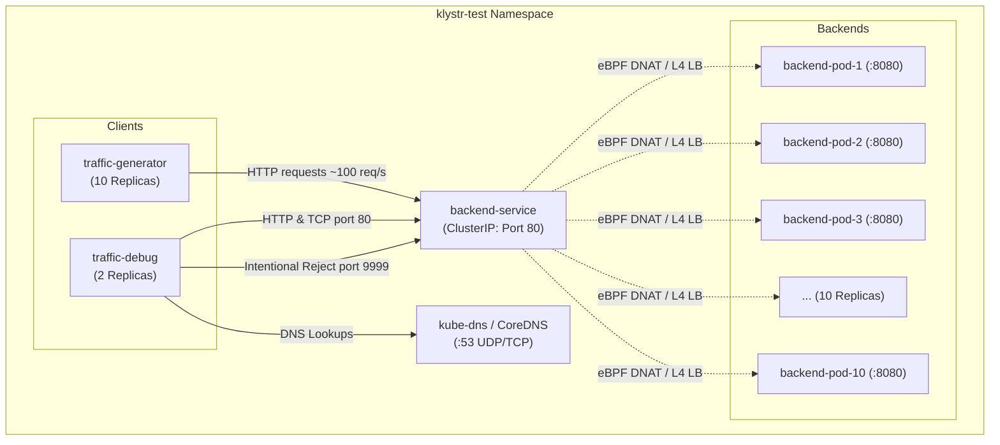

# Klystr Telemetry: MicroK8s + Cilium Network Traffic Test Environment

This directory contains a complete, self-contained test environment specifically designed for validating **Klystr Telemetry** (eBPF-based Kubernetes network flow observability).

> [!IMPORTANT]
> **Hubble Independence**: This test environment does not install, configure, or use Hubble CLI or Hubble UI. All telemetry collection, aggregation, and visualization are designed directly for **Klystr Telemetry** leveraging the underlying Cilium CNI eBPF datapath.

---

## Table of Contents

1. [Architecture & Network Topology](#1-architecture--network-topology)
2. [Quick Start](#2-quick-start)
3. [Manifest Overview (klystr-test.yaml)](#3-manifest-overview-klystr-testyaml)
4. [Kubernetes Verification Commands](#4-kubernetes-verification-commands)
5. [Verifying Actual Traffic & Load-Balancing](#5-verifying-actual-traffic--load-balancing)
6. [Klystr Telemetry Observation Model](#6-klystr-telemetry-observation-model)
7. [Cilium & eBPF Datapath Mechanics](#7-cilium--ebpf-datapath-mechanics)
8. [Packet-Level vs. Flow-Level Inspection (tcpdump)](#8-packet-level-vs-flow-level-inspection-tcpdump)
9. [Klystr Metrics Reference](#9-klystr-metrics-reference)
10. [Test Scenarios & Dynamic Scaling](#10-test-scenarios--dynamic-scaling)
11. [Dynamic Kubernetes Events](#11-dynamic-kubernetes-events)
12. [Cleanup](#12-cleanup)

---

## 1. Architecture & Network Topology

All workloads run in the isolated `klystr-test` namespace.

```text
                                  klystr-test Namespace

            ┌─────────────────────────────────────────────────────────┐
            │                 traffic-generator (10x)                 │
            │  [generator-1]  [generator-2]  ...  [generator-10]      │
            │             (~5-10 HTTP req/sec per pod)                │
            └────────────────────────────┬────────────────────────────┘
                                         │
                                         │ HTTP / TCP (Port 80)
                                         ▼
                               ┌───────────────────┐
                               │  backend-service  │
                               │     ClusterIP     │
                               │   (Port 80:8080)  │
                               └─────────┬─────────┘
                                         │
                                         │ Cilium eBPF Service Load Balancing
                                         │ (Weighted / Maglev / Random Hash)
                                         ▼
            ┌─────────────────────────────────────────────────────────┐
            │                      backend (10x)                      │
            │   [backend-1]    [backend-2]    ...    [backend-10]     │
            │             (Port 8080, Pod Identification)             │
            └─────────────────────────────────────────────────────────┘

            ┌─────────────────────────────────────────────────────────┐
            │                  traffic-debug (2x)                     │
            │  - HTTP GET: backend-service:80                         │
            │  - DNS query: backend-service.klystr-test.svc.cluster...│
            │  - TCP SYN/ACK: backend-service:80                      │
            │  - TCP RST (Failed flow): backend-service:9999          │
            └─────────────────────────────────────────────────────────┘
```



---

## 2. Quick Start

Run the automated helper scripts included in this folder:

```bash
cd /home/noman/projects/klystr/examples/telemetry/live-network

# 1. Deploy the test environment
./deploy.sh

# 2. Verify traffic and load-balancing
./verify-traffic.sh

# 3. Test dynamic scaling scenarios
./scale-test.sh scenario-2

# 4. Cleanup when finished
./cleanup.sh
```

---

## 3. Manifest Overview (`klystr-test.yaml`)

The single manifest [`klystr-test.yaml`](file:///home/noman/projects/klystr/examples/telemetry/live-network/klystr-test.yaml) defines:

1. **Namespace**: `klystr-test`
2. **Backend Deployment (`backend`)**:
   - 10 replicas
   - Listens on port `8080`
   - Returns pod identity in response body:
     ```text
     Hello from Klystr network test

     Pod: backend-7d8f9
     Hostname: backend-7d8f9
     ```
   - Standard labels: `app: backend`, `telemetry: klystr-test`
3. **Backend Service (`backend-service`)**:
   - `type: ClusterIP`
   - `port: 80` mapped to `targetPort: 8080`
   - Standard labels: `app: backend`, `telemetry: klystr-test`
4. **Traffic Generator Deployment (`traffic-generator`)**:
   - 10 replicas
   - Sends ~5–10 HTTP requests/second per pod continuously (`curl -s http://backend-service; sleep 0.1`)
   - Labels: `app: traffic-generator`, `telemetry: klystr-test`
5. **Traffic Debug Deployment (`traffic-debug`)**:
   - 2 replicas
   - Generates 4 distinct traffic profiles:
     - **HTTP GET**: `backend-service:80`
     - **DNS Query**: `backend-service.klystr-test.svc.cluster.local` (UDP 53)
     - **Successful TCP**: Handshake on port `80`
     - **Failed TCP**: Connection attempt to closed port `9999` (triggers TCP RST / connection drop for observing dropped/rejected flows in Klystr)
   - Labels: `app: traffic-debug`, `telemetry: klystr-test`

---

## 4. Kubernetes Verification Commands

Deploy and inspect the cluster state with standard `microk8s kubectl`:

```bash
# Apply the complete manifest
microk8s kubectl apply -f klystr-test.yaml

# Check all workloads in the namespace
microk8s kubectl get all -n klystr-test

# List all pods with their assigned IP addresses and host nodes
microk8s kubectl get pods -n klystr-test -o wide

# Check the backend service ClusterIP and port
microk8s kubectl get svc -n klystr-test

# Inspect endpoints attached to backend-service (should list all 10 backend pod IPs:8080)
microk8s kubectl get endpoints -n klystr-test

# Inspect EndpointSlices
microk8s kubectl get endpointslices -n klystr-test

# Stream pod status changes in real-time
microk8s kubectl get pods -n klystr-test -w
```

---

## 5. Verifying Actual Traffic & Load-Balancing

### Enter a traffic generator pod

```bash
microk8s kubectl exec -it \
  -n klystr-test \
  deploy/traffic-generator \
  -- sh
```

### Manual Request Testing

Inside the container:

```bash
# 1. Single HTTP request
curl -s http://backend-service

# 2. Continuous request stream
while true; do
  curl -s http://backend-service
  sleep 0.1
done
```

### Verifying Load Distribution Across Replicas

From your workstation shell, send 20 requests and observe different pod hostnames responding:

```bash
POD=$(microk8s kubectl get pods -n klystr-test -l app=traffic-generator -o jsonpath='{.items[0].metadata.name}')

for i in $(seq 1 20); do
  microk8s kubectl exec -n klystr-test "${POD}" -- curl -s http://backend-service | grep "^Pod:"
done
```

*Example Output:*
```text
Pod: backend-6cb9d5d8fb-8f92z
Pod: backend-6cb9d5d8fb-v4xqk
Pod: backend-6cb9d5d8fb-8f92z
Pod: backend-6cb9d5d8fb-m2b47
Pod: backend-6cb9d5d8fb-9kpxd
...
```

---

## 6. Klystr Telemetry Observation Model

Klystr Telemetry observes network activity across the Kubernetes cluster using eBPF probes attached to socket and network interface hooks.

### What Klystr Captures

| Dimension | Observed Telemetry Attributes |
| :--- | :--- |
| **Endpoint Metadata** | Source Pod, Destination Pod, Source IP, Destination IP, Source Port, Destination Port |
| **L4 Protocol & State** | Protocol (TCP/UDP), TCP Flags (`SYN`, `SYN-ACK`, `ACK`, `FIN`, `RST`), TCP State (`ESTABLISHED`, `TIME_WAIT`, `CLOSED`) |
| **Flow Direction** | `EGRESS` (leaving generator pod), `INGRESS` (entering backend pod) |
| **Kubernetes Identity** | Namespace (`klystr-test`), Service (`backend-service`), Deployment (`backend`, `traffic-generator`, `traffic-debug`), Node name |
| **Throughput & Counters** | Packet count, Byte count, Duration (ms), Latency (RTT) |
| **Flow Verdict** | `FORWARDED` (HTTP port 80), `DROPPED` / `REJECTED` (Port 9999 probe) |

### Flow Representation

Klystr correlates the virtual Service IP into the actual concrete pod flows:

```text
traffic-generator-pod (IP: 10.1.0.42, Port: 48210)
       ↓  [EGRESS to Service IP 10.152.183.99:80]
Cilium eBPF Service Translation (DNAT to Pod IP: 10.1.0.88:8080)
       ↓
backend-pod (IP: 10.1.0.88, Port: 8080)
```

In the Klystr graph/live flow view, this is presented as:
- **Logical Flow**: `traffic-generator` ➔ `backend-service`
- **Physical/Pod Flow**: `traffic-generator-xxxx` ➔ `backend-yyyy`

---

## 7. Cilium & eBPF Datapath Mechanics

Underneath Kubernetes, traffic flows through Linux kernel eBPF programs attached by Cilium:

```text
[ traffic-generator Container ]
             │
             ▼ (Socket Layer: sock_ops / cgroup eBPF)
[ Pod veth interface (lxc...) ]
             │
             ▼ (Traffic Control: tc eBPF ingress/egress)
[ Cilium BPF Datapath ]
  ├─ 1. Flow Lookup & Connection Tracking (bpf_ct)
  ├─ 2. Kubernetes Service Resolution:
  │     ClusterIP:80 translated to Backend_Pod_IP:8080 (bpf_lb)
  ├─ 3. Network Policy Check (Allowed)
  ├─ 4. Telemetry Event Emitted to Klystr Perf Ring Buffer
  └─ 5. Direct Packet Forwarding (bpf_redirect)
             │
             ▼
[ backend Container veth (lxc...) ]
             │
             ▼
[ Backend httpd on port 8080 ]
```

### Telemetry Tap Points for Klystr

1. **`sock_ops` / `sock_addr`**: Intercepts `connect()`, `sendmsg()`, and socket state transitions at zero packet-copy overhead. Captures TCP latency and socket-to-process correlations.
2. **`tc` (Traffic Control) on veth pairs (`lxc+`)**: Intercepts all L3/L4 packets entering and exiting container namespaces.
3. **BPF Connection Tracker (`cilium_ct_*`)**: Tracks flow lifetimes, packet/byte counts, and TCP state machine flags.

---

## 8. Packet-Level vs. Flow-Level Inspection (tcpdump)

### Identifying Network Interfaces

```bash
# List interfaces on the node
ip addr
```

Look for `cilium_host`, `cilium_net`, and `lxc*` interfaces representing container virtual ethernet pairs.

### Capturing Raw Packets (`tcpdump`)

```bash
# 1. Capture all HTTP traffic on port 80 or 8080 across all interfaces
sudo tcpdump -i any -n "tcp port 80 or tcp port 8080" -c 20

# 2. Capture traffic for a specific backend pod IP (replace with actual pod IP)
BACKEND_IP=$(microk8s kubectl get pod -n klystr-test -l app=backend -o jsonpath='{.items[0].status.podIP}')
sudo tcpdump -i any -n "host ${BACKEND_IP}" -c 20

# 3. Capture failed connection attempts (TCP RST or port 9999 traffic)
sudo tcpdump -i any -n "tcp port 9999" -c 10

# 4. View TCP handshake flags (SYN, ACK, RST)
sudo tcpdump -i any -n "tcp[tcpflags] & (tcp-syn|tcp-rst) != 0" -c 20
```

### Packet-Level vs. Flow-Level Comparison

| Feature | Packet-Level (e.g. `tcpdump`) | Flow-Level (Klystr Telemetry) |
| :--- | :--- | :--- |
| **Data Model** | Individual, discrete packet buffers | Aggregated network conversations (5-tuple + time window) |
| **Kubernetes Context** | Raw IPs, MAC addresses, TCP ports | Pod names, Namespace, Service name, Deployment labels |
| **Storage & Overhead** | High CPU & disk I/O; packet payload capture | Ultra-low overhead; lightweight eBPF event counters |
| **Directionality** | Packet by packet (ingress / egress mix) | Bidirectional session tracking with latency metrics |
| **Ideal For** | Deep packet analysis, payload inspection | Topology visualization, anomaly detection, real-time telemetry |

---

## 9. Klystr Metrics Reference

The workloads generated by `klystr-test` produce the following metric classes in Klystr:

### Network Metrics
- **Packets/sec**: Rate of inbound/outbound packets per pod and per service.
- **Bytes/sec**: Bandwidth consumption between deployments.
- **Total Packets / Total Bytes**: Cumulative transfer volume.

### TCP Metrics
- **Active Connections**: Concurrent established TCP sockets.
- **Connection Duration**: Lifetime of client-server sessions.
- **TCP Flags Count**:
  - `SYN` / `SYN-ACK`: New connection setup rate.
  - `ACK`: Data transfer acknowledgments.
  - `FIN`: Graceful connection closures.
  - `RST`: Aborted or rejected connections (generated continuously by `traffic-debug` targeting port 9999).

### Flow Dimensions
- `source`: Source pod / service / workload identity.
- `destination`: Destination pod / service / workload identity.
- `source_port`: Ephemeral client port (e.g., 32768–60999).
- `destination_port`: Target port (`80`, `8080`, `53`, `9999`).
- `protocol`: `TCP`, `UDP`.
- `verdict`: `FORWARDED`, `DROPPED`, `REJECTED`.

---

## 10. Test Scenarios & Dynamic Scaling

Use `./scale-test.sh` to trigger various traffic profiles:

### Scenario 1: Baseline (10 Generators ➔ 1 Service ➔ 10 Backends)
```bash
./scale-test.sh scenario-1
```
- **Traffic**: ~100 requests/second.
- **Topology**: Symmetrical 10-to-10 fan-out through `backend-service`.

### Scenario 2: High Traffic (20 Generators ➔ 1 Service ➔ 20 Backends)
```bash
./scale-test.sh scenario-2
```
- **Traffic**: ~200 requests/second across 20 client pods.
- **Verification**: Check if Klystr handles increased flow throughput and graph node density smoothly.

### Scenario 3: Asymmetric Contention (20 Generators ➔ 5 Backends)
```bash
./scale-test.sh scenario-3
```
- **Traffic**: 20 generator pods targeting only 5 backend replicas.
- **Observation**: Klystr demonstrates higher flow aggregation density per backend pod.

### Scenario 4: Intentional Failed Flows (Port 9999)
- Automatically generated by the 2 `traffic-debug` pods.
- Observe how Klystr visualizes `REJECTED` or `FAILED` flows alongside healthy flows.

---

## 11. Dynamic Kubernetes Events

Observe how Klystr dynamically updates its topology graph when Kubernetes changes occur in real-time:

### Step 1: Scale down backends to 5
```bash
microk8s kubectl scale deployment backend -n klystr-test --replicas=5
```
*Klystr observation:* 5 backend nodes disappear from the active graph; remaining 5 absorb 100% of the load.

### Step 2: Scale up backends to 15
```bash
microk8s kubectl scale deployment backend -n klystr-test --replicas=15
```
*Klystr observation:* 10 new pods appear, receive new pod IPs and endpoints, and flows immediately fan out to all 15 endpoints.

### Step 3: Rolling Restart of Backends
```bash
microk8s kubectl rollout restart deployment backend -n klystr-test
```
*Klystr observation:* Old pod IPs transition to terminating/closed state; new pod IPs are provisioned, and traffic shifts seamlessly with zero dropped requests on `backend-service`.

---

## 12. Cleanup

To completely remove the test environment without affecting Cilium, Klystr, MicroK8s, or any other namespace:

```bash
./cleanup.sh
```

Or execute directly:

```bash
microk8s kubectl delete namespace klystr-test
```
