```mermaid
graph TD
    subgraph "klystr-multitier Namespace"
        TG["synthetic-audience-generator<br/>(2 Replicas)"]
        FE["edge-cdn-ingress<br/>(frontend-service:80, 2 Replicas)"]
        GW["dynamic-api-gateway<br/>(api-gateway-service:80, 2 Replicas)"]

        API1["playback-session-service<br/>(api1-service:80, 2 Replicas)"]
        API2["catalog-recommendation-service<br/>(api2-service:80, 2 Replicas)"]

        R_MASTER["redis-master-service<br/>(StatefulSet 1x, :6379)"]
        R_REPLICA["redis-replica-service<br/>(StatefulSet 1x, :6379)"]
        
        DB["postgresql-primary<br/>(db-service:5432, StatefulSet 1x)"]
        DB_REP0["postgresql-standby-0<br/>(db-replica-0:5432)"]
        DB_REP1["postgresql-standby-1<br/>(db-replica-1:5432)"]
        
        ETL["streaming-qoe-analytics<br/>(etl-service:80, 2 Replicas)"]

        TG -->|HTTP /playback & /catalog| FE
        TG -->|HTTP /dashboard & /bi| FE
        
        FE -->|Reverse Proxy /playback| GW
        FE -->|Reverse Proxy /catalog| GW
        FE -->|Reverse Proxy /dashboard & /bi| ETL

        GW -->|L4 eBPF Load Balance| API1
        GW -->|L4 eBPF Load Balance| API2

        API1 -->|TCP 6379 SET/GET Playback Session| R_MASTER
        API2 -->|TCP 6379 SET/GET Recommendation Cache| R_MASTER

        API1 -->|TCP 5432 DRM & Account Transaction| DB
        API2 -->|TCP 5432 Catalog Queries| DB

        R_MASTER -.->|Persistent TCP 6379 Replication Stream| R_REPLICA
        
        DB -.->|WAL Streaming Link 1| DB_REP0
        DB_REP0 -.->|Cascading WAL Streaming Link 2| DB_REP1

        DB_REP0 -->|Direct Analytical Read-Offload| ETL
        DB_REP1 -->|Direct Analytical Read-Offload| ETL
    end
```

# Klystr Telemetry: Netflix-Grade Enterprise Streaming Architecture (Example 2)

This directory contains a complete, production-grade Kubernetes test environment modeled after the **Netflix Cloud Streaming & Open Connect** architecture. It is specifically engineered for validating and demonstrating **Klystr Telemetry** (eBPF-based Kubernetes network flow observability, socket tracking, and service dependency mapping).

> [!IMPORTANT]
> **Hubble Independence**: This test environment does not install, configure, or use Hubble CLI or Hubble UI. All network telemetry collection, socket aggregation, and flow visualization are designed directly for **Klystr Telemetry** leveraging the underlying Cilium CNI eBPF datapath.

---

## Table of Contents

1. [Architecture & Network Topology](#1-architecture--network-topology)
2. [Workload Components & Pod Specification](#2-workload-components--pod-specification)
3. [Quick Start](#3-quick-start)
4. [Manifest Overview (`klystr-multitier.yaml`)](#4-manifest-overview-klystr-multitieryaml)
5. [Dynamic Viewer Traffic & Rate Control](#5-dynamic-viewer-traffic--rate-control)
6. [20-Step End-to-End Verification Suite](#6-20-step-end-to-end-verification-suite)
7. [Klystr Telemetry Observation Model](#7-klystr-telemetry-observation-model)
8. [Cilium & eBPF Datapath Mechanics](#8-cilium--ebpf-datapath-mechanics)
9. [Chaos Testing & Fault Injection Scenarios](#9-chaos-testing--fault-injection-scenarios)
10. [Expected Klystr Topology Graph](#10-expected-klystr-topology-graph)
11. [Cleanup](#11-cleanup)

---

## 1. Architecture & Network Topology

All workloads run in the dedicated, isolated `klystr-multitier` namespace (10 components, 17 total pods).

```text
                                klystr-multitier Namespace
                        
                 ┌────────────────────────────────────────────────────────┐
                 │          Synthetic Audience Load Generator (2x)        │
                 │   [generator-1]                     [generator-2]      │
                 │   (Smart TVs, 4K UHD Viewers, Mobile, Browser Clients) │
                 └───────────────────────────┬────────────────────────────┘
                                             │
                                             │ HTTP/1.1 (Port 80)
                                             ▼
                 ┌────────────────────────────────────────────────────────┐
                 │              Open Connect Edge CDN Ingress             │
                 │                frontend-service (Port 80)              │
                 │                   [frontend-1] [frontend-2]            │
                 └─────────────┬───────────────────────────┬──────────────┘
                               │                           │
                               │ /playback, /catalog       │ /dashboard, /bi, /analytics
                               ▼                           ▼
                 ┌───────────────────────────┐ ┌───────────────────────────┐
                 │   Dynamic API Gateway     │ │  Streaming QoE Analytics  │
                 │    api-gateway-service    │ │      & BI Dashboard       │
                 │          (Port 80)        │ │        etl-service        │
                 │      [gateway-1/2]        │ │         (Port 80)         │
                 └─────────────┬─────────────┘ └─────────────▲─────────────┘
                               │                             │
                 ┌─────────────┴─────────────┐               │ Direct Read-Offload
                 ▼                           ▼               │ (Port 5432 TCP)
        ┌──────────────────┐        ┌──────────────────┐     │
        │ Playback Service │        │ Catalog Service  │     │
        │   api1-service   │        │   api2-service   │     │
        │  [api1-1] [api1-2│        │  [api2-1] [api2-2│     │
        └───────┬──────────┘        └────────┬─────────┘     │
                │                            │               │
        ┌───────┴──────────────┐ ┌───────────┴───────┐       │
        ▼                      ▼ ▼                   ▼       │
 ┌──────────────┐     ┌────────────────┐                     │
 │ Redis Master │     │  DB Primary    │ (PostgreSQL 16 OLTP)│
 │ redis-master │     │   db-service   │                     │
 │    (6379)    │     │     (5432)     │                     │
 └──────┬───────┘     └────────┬───────┘                     │
        │                      │                             │
        │ Persistent TCP       │ Cascading WAL Streaming     │
        │ Replication          │ Replication (TCP 5432)      │
        ▼                      ▼                             │
 ┌──────────────┐     ┌──────────────────────────────────┐   │
 │ Redis Replica│     │  Cascading Read Replicas (2x)    │   │
 │redis-replica │     │  db-replica-0 ──WAL──> db-repl-1 ┼───┘
 │    (6379)    │     │       (Read-Only Standby)        │
 └──────────────┘     └──────────────────────────────────┘
```



---

## 2. Workload Components & Pod Specification

| Component | Kind & Replicas | Ports | Base Image | Netflix Streaming Architectural Role |
| :--- | :--- | :--- | :--- | :--- |
| **`frontend`** | Deployment (2x) | 80 | `nginx:alpine` | **Open Connect Edge CDN Ingress**: Public entrypoint routing client requests to gateway or BI engine. |
| **`api-gateway`** | Deployment (2x) | 80 | `nginx:alpine` | **Dynamic Reverse Proxy (Zuul-style)**: Routes traffic across internal microservices with keepalive connection pooling. |
| **`api1`** | Deployment (2x) | 8080 (svc: 80) | `python:3-alpine` | **Playback & Session Service**: Validates 4K UHD streaming tokens, DRM Widevine licenses, and session state. |
| **`api2`** | Deployment (2x) | 8080 (svc: 80) | `python:3-alpine` | **Video Metadata & Catalog Service**: Personalized recommendations and search rank models. |
| **`redis-master`** | StatefulSet (1x) | 6379 | `redis:7-alpine` | **Playback Cache Master**: Authoritative in-memory session store & distributed rate limiter. |
| **`redis-replica`** | StatefulSet (1x) | 6379 | `redis:7-alpine` | **Playback Cache Replica**: Read-replica synchronized via continuous TCP replication stream. |
| **`db`** | StatefulSet (1x) | 5432 | `postgres:16-alpine` | **Primary Relational Database (OLTP)**: User accounts, billing ledger, and DRM license transactions. |
| **`db-replica`** | StatefulSet (2x) | 5432 | `postgres:16-alpine` | **Cascading Analytical Read Replicas**: Primary ➔ `db-replica-0` ➔ `db-replica-1` for isolated analytical read-offload. |
| **`etl-service`** | Deployment (2x) | 8080 (svc: 80) | `python:3-alpine` | **Streaming QoE Analytics Engine**: Ingests viewing sessions from standby replicas, serves REST metrics and Executive Dashboard. |
| **`traffic-generator`**| Deployment (2x) | None (egress) | `python:3-alpine` | **Synthetic Audience Simulator**: Generates realistic viewer traffic patterns with dynamic 0x–10x rate scaling. |

**Total Pod Count**: 2 + 2 + 2 + 2 + 1 + 1 + 1 + 2 + 2 + 2 = **17 Pods**.

---

## 3. Quick Start

Run the automated helper scripts included in this folder:

```bash
cd /home/noman/projects/klystr/examples/telemetry/live-network/example_2

# 1. Deploy the complete multi-tier streaming test environment
./deploy.sh

# 2. Run the 20-step verification suite
./verify-traffic.sh

# 3. Check live traffic telemetry status
./scale-test.sh traffic-status

# 4. View real-time Quality of Experience (QoE) metrics
./scale-test.sh bi-query

# 5. Clean up when finished
./cleanup.sh
```

---

## 4. Manifest Overview (`klystr-multitier.yaml`)

The single manifest [`klystr-multitier.yaml`](file:///home/noman/projects/klystr/examples/telemetry/live-network/example_2/klystr-multitier.yaml) defines the complete environment:

1. **Enterprise Proxy Configuration**:
   - Both `frontend-config` and `gateway-config` define HTTP/1.1 `keepalive 32;` connection pooling and `proxy_set_header Connection ""` to ensure persistent connection reuse observable in eBPF socket maps.
   - Dual routing paths: `/playback` and `/api1` route to Playback Service; `/catalog` and `/api2` route to Catalog Service; `/dashboard`, `/bi`, and `/analytics` route to QoE Analytics Engine.
2. **PostgreSQL Cascading Replication**:
   - `db-replica-0` performs `pg_basebackup` from `db-service:5432` (Primary).
   - `db-replica-1` performs `pg_basebackup` from `db-replica-0.db-replica-nodes:5432` (Cascading replica-to-replica streaming).
   - Both replicas enforce strict read-only mode (`pg_is_in_recovery() = true`).
3. **QoE Analytics Engine & Dashboard**:
   - Continuous background worker extracting micro-batches from standby replicas.
   - Self-refreshing dark-mode executive dashboard styled with Netflix crimson (`#E50914`), live status pills, and telemetry tables.
4. **Synthetic Audience Simulator**:
   - Controllable in real-time via the `traffic-control` ConfigMap.
   - Sends client identification headers (`User-Agent: Netflix-ExoPlayer/2.18`, `X-Device-Type: SmartTV-4K-UHD`).
   - Periodically injects closed-port probes to port 9999 to validate eBPF `DROPPED` / `REJECTED` flow capture.

---

## 5. Dynamic Viewer Traffic & Rate Control

The audience simulator is dynamically controllable in real-time **without restarting or redeploying any pods**:

```bash
# Check current traffic rate and status
./scale-test.sh traffic-status

# Immediately stop all traffic (Strict 0 RPS drop)
./scale-test.sh traffic-stop

# Resume traffic at baseline (1x = 10 RPS)
./scale-test.sh traffic-1x

# Scale traffic to 2x (20 RPS)
./scale-test.sh traffic-2x

# Scale traffic to 5x (50 RPS)
./scale-test.sh traffic-5x

# Scale traffic to 10x (100 RPS)
./scale-test.sh traffic-10x

# Scale to arbitrary multiplier (e.g. 7x = 70 RPS)
./scale-test.sh traffic 7
```

### Strict Traffic Stop Verification
When `./scale-test.sh traffic-stop` is executed, the generator pods remain running in standby mode but immediately cease sending HTTP requests. The effective request rate reaching the application stack drops to **0 RPS**.

---

## 6. 20-Step End-to-End Verification Suite

Run the full end-to-end test suite:

```bash
./verify-traffic.sh
```

The verification suite executes across 5 distinct phases:

### Phase 1: Cluster Topology & Discovery
1. **Namespace Verification**: Confirms `klystr-multitier` presence and labels.
2. **Workload Pods**: Validates all 17 pods are in `Running` phase.
3. **Services**: Verifies all 9 ClusterIP services and 1 headless service.
4. **Service Endpoints**: Validates endpoint IP registration.
5. **Cilium EndpointSlices**: Inspects eBPF-managed EndpointSlices.

### Phase 2: Edge Ingress & Dynamic Routing
6. **Edge Ingress Health**: Verifies HTTP 200 health status on `frontend-service:80/healthz`.
7. **Edge to Gateway Forwarding**: Tests edge routing to internal API Gateway.
8. **Playback Service Full Path**: Traverses `Edge ➔ Gateway ➔ Playback Service ➔ Redis + DB`.
9. **Catalog Service Full Path**: Traverses `Edge ➔ Gateway ➔ Catalog Service ➔ Redis + DB`.

### Phase 3: Distributed Data & Caching Tier
10. **Redis Socket Connectivity**: Tests TCP connection and `PING` from microservice pod.
11. **Redis Master ➔ Replica Continuous Replication**: Writes key on Master, reads from Replica.
12. **PostgreSQL Primary Database**: Direct query execution on `db-service:5432`.
13. **Cilium eBPF Service Load Balancing**: Validates distribution of 12 requests across replicas.

### Phase 4: Network Diagnostics & Fault Injection
14. **Failed TCP Probe (Port 9999)**: Generates TCP RST / connection rejection for eBPF drop metrics.
15. **End-to-End Latency Profiling**: Measures millisecond latency across the complete multi-tier stack.
16. **High-Concurrency Active Sockets**: Validates concurrent socket creation and teardown.

### Phase 5: Cascading Replication & Streaming Telemetry
17. **Cascading Standby Status & Write Rejection**: Verifies `db-replica-0` and `db-replica-1` are in recovery and reject write queries.
18. **Cascading WAL Streaming Replication**: Inspects active WAL sender sockets on Primary and Replica-0.
19. **Streaming QoE Analytics**: Verifies continuous session extraction on `etl-service:80/analytics`.
20. **Executive QoE Dashboard**: Tests full traversal from Edge Ingress to BI Dashboard (`/dashboard`).

---

## 7. Klystr Telemetry Observation Model

Klystr Telemetry observes network activity across the Kubernetes cluster using eBPF probes attached to Linux kernel socket and network interface hooks.

### Observed Dimensions & Attributes

| Dimension | Observed Telemetry Attributes |
| :--- | :--- |
| **Endpoint Metadata** | Source Pod, Destination Pod, Source IP, Destination IP, Source Port, Destination Port |
| **L4 Protocol & State** | TCP/UDP, Flags (`SYN`, `SYN-ACK`, `ACK`, `FIN`, `RST`), TCP State (`ESTABLISHED`, `TIME_WAIT`, `CLOSED`) |
| **Flow Directionality** | `EGRESS` (leaving client or proxy), `INGRESS` (entering upstream target) |
| **Workload Identity** | Namespace (`klystr-multitier`), Services (`frontend`, `api-gateway`, `api1`, `api2`, `redis`, `db`, `etl`) |
| **Throughput & Counters** | Packet count, Byte count, Duration (ms), Kernel Socket RTT (`tcpi_rtt`) |
| **Flow Verdict** | `FORWARDED` (Standard traffic), `DROPPED` / `REJECTED` (Port 9999 closed probe) |

---

## 8. Cilium & eBPF Datapath Mechanics

### 1. Socket-Level Service Load Balancing (`cgroup/sock`)
When the API Gateway connects to `api1-service.klystr-multitier.svc.cluster.local:80`, Cilium's eBPF program attached to the `connect()` syscall intercepts the connection **in the Linux kernel socket layer**. It performs Destination NAT (DNAT) from the Service Virtual IP (ClusterIP) to a backend pod IP before any IP packet is generated. This eliminates traditional iptables overhead.

### 2. Persistent vs. Short-Lived TCP Streams
* **Short-Lived HTTP/1.1 Flows**: Client requests to Edge Ingress open and close sockets rapidly, creating brief `ESTABLISHED` states that transition quickly to `TIME_WAIT`.
* **Persistent Replication Streams**:
  - `redis-replica-0 ➔ redis-master-service:6379`
  - `db-replica-0 ➔ db-service:5432`
  - `db-replica-1 ➔ db-replica-0:5432`
  These connections remain in `ESTABLISHED` status continuously for hours, with packet and byte counters incrementing steadily without reconnections.

### 3. Closed-Port Drop Observability (TCP RST)
Probes sent to port `9999` trigger Linux kernel `TCP RST` packets. Cilium and Klystr capture these flows and tag them with `VERDICT_DROPPED` / `VERDICT_REJECTED`, allowing security and network operators to detect misrouted packets and port scans.

---

## 9. Chaos Testing & Fault Injection Scenarios

### Scenario A: High-Concurrency Active Socket Surge
Open 15 concurrent TCP connections held open for 20 seconds:
```bash
./scale-test.sh active-connections 15 20
```
*Observability in Klystr*: Watch the `ESTABLISHED` socket counter spike simultaneously on `frontend-service`.

### Scenario B: Redis Cache Outage & Recovery
Simulate a cache failure:
```bash
./scale-test.sh redis-failure
```
*Observability in Klystr*: Observe connection timeouts from Playback microservices, followed by immediate flow re-establishment when Redis restarts.

### Scenario C: Microservice Tier Scaling
Scale application microservices up to 4 replicas (while preserving data stores):
```bash
./scale-test.sh scale-up
```
*Observability in Klystr*: Cilium's eBPF map instantly updates to distribute traffic across 4 pods per tier without connection drops. Return to baseline:
```bash
./scale-test.sh scale-down
```

### Scenario D: Long-Lived Replication Inspection
Inspect active streaming replication links:
```bash
./scale-test.sh long-connections
```

---

## 10. Expected Klystr Topology Graph

In the Klystr Telemetry canvas, the generated dependency graph displays:

```text
               Synthetic Audience (2x)
                         │
                         │ HTTP (80)
                         ▼
             Edge CDN Ingress (2x)
               │               │
  /playback,   │               │ /dashboard, /bi
  /catalog     ▼               ▼
        API Gateway (2x)     Streaming QoE Analytics (2x)
         │           │                 ▲
 /playback│   /catalog│                 │ Direct Read-Offload (5432)
         ▼           ▼                 │
     Playback     Catalog              │
     Service      Service              │
       │   │       │   │               │
  SET/ │   │       │   │               │
  GET  ▼   ▼       ▼   ▼               │
    Redis   PostgreSQL Primary (5432)  │
    Master        │                    │
      │           │ WAL Link 1         │
      │ repl      ▼                    │
      ▼      Cascading Replica-0 (5432)│
    Redis         │                    │
   Replica        │ WAL Link 2         │
                  ▼                    │
             Cascading Replica-1 (5432)┘
```

---

## 11. Cleanup

To completely remove the multi-tier streaming test environment:

```bash
./cleanup.sh
```
*(Or directly via `microk8s kubectl delete namespace klystr-multitier`)*.
